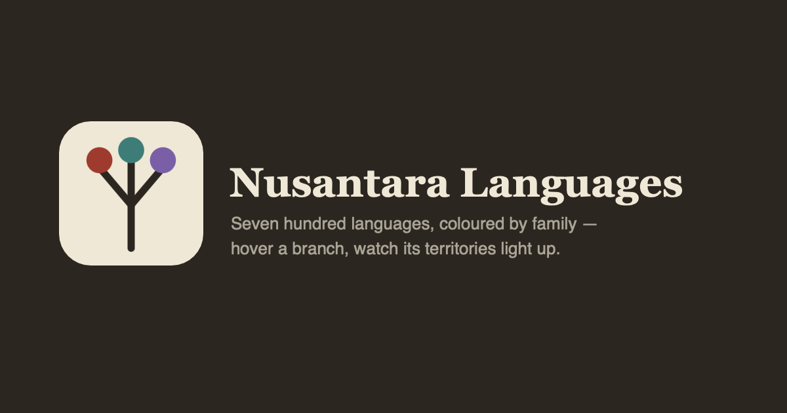

<div align="center">



# Nusantara Languages

**A family-coloured language map of Indonesia, bound to its genealogical tree.**

Hover a branch and its territories light up. Click a territory and the tree scrolls to it and
opens its ancestry, from the root family down.

[**Open the map →**](https://andifathulms.github.io/nusantara-languages/)

[](https://github.com/andifathulms/nusantara-languages/actions/workflows/deploy.yml)
[](LICENSE)
[](LICENSE-DATA.md)
[](#what-is-not-here)
[](#how-it-is-built)

</div>

> **Peta ini bukan sensus penutur hari ini.** Sebaran wilayah mengikuti atlas bahasa yang
> terbit antara 1990 dan 2020; batas antarbahasa pada kenyataannya berupa gradien, bukan garis.

---

## The idea

Most language maps are a wall of colour with a legend you have to keep looking back at. The
genealogy — which language descends from which — lives somewhere else entirely, usually in a
paper.

This puts the two side by side and wires them together. The tree is not an illustration next
to the map; it is the same object, drawn a second way. That linkage **is** the product. A
coloured map on its own would be a different, lesser project.

## By the numbers

Every figure below is read from `data/bundle/coverage.json`, which the pipeline emits from the
actual bundle. None of it is typed in by hand, so none of it can drift.

| | |
|---:|:---|
| **726** | languages of Indonesia (Glottolog v5.3, `Countries` contains `ID`) |
| **421** | with a real speaker-area polygon — **58%** |
| **305** | with no polygon, drawn as a **point** and marked as one |
| **56** | top-level units, of which **23** are isolates |
| **464** | Austronesian — which is why the map also reads at subgroup level |
| **19,570** | polygon vertices, against a 60,000 budget |

Coverage is published rather than hidden. A gap in the data should look like a gap.

## What is not here

Three things this map deliberately does not do, and one source it will not touch.

**It does not claim to be current.** The polygon sources describe where languages were
*documented* — 1990–2007 for the world atlas layer, 2010–2020 for Alor–Pantar. The period is
stated on the plate itself, not buried in a methods page, and it is derived from the source
manifest rather than hardcoded.

**It does not turn points into territories.** Glottolog's coordinate for a language is
frequently the midpoint of a dispersed or disjoint population. Inflating one into a shape
would invent a claim nobody made. No convex hulls, no default Voronoi — a point stays a point.

**It does not draw boundaries as facts.** Dialect continua are the norm across the
archipelago. Boundaries render as hairlines, and the method page says plainly that they are
gradients.

**Ethnologue is never used, in any field** — not speaker counts, not EGIDS status, not
alternate names. It is proprietary, and a test asserts the shipped bundle carries no field
traceable to it. Shipping without speaker counts is honest; shipping with borrowed ones would
be both a licence problem and a factual one.

## Sources and licences

Glottolog (CC-BY-4.0) is the spine: the languoid table, the classification, the coordinates.
Polygons come from two CC-BY-4.0 Glottography datasets — Asher & Moseley 2007 and Schapper
2020. Land comes from Natural Earth (public domain), so that a gap in language coverage reads
as *unrecorded* rather than as sea.

**The Wurm & Hattori Glottography dataset is CC-BY-NC-4.0 and is excluded.** The
non-commercial restriction cannot be carried into a CC-BY-SA-4.0 derived bundle, so it is
recorded in the manifest as a refusal with its reason, and published on the method page. That
decision changed the map's period, and the copy changed with it.

Every source declares a licence and a pinned version in the manifest, and `pnpm
sources:validate` refuses to build on an unresolved one. Full table in
[LICENSE-DATA.md](LICENSE-DATA.md).

Code is MIT ([LICENSE](LICENSE)). The derived bundle is CC-BY-SA-4.0, as Glottolog requires.

## Measured, not assumed

`pnpm bench:plate` gates the render budget on every push:

| | measured | budget |
|---|---:|---:|
| Polygon vertices | 19,570 | 60,000 |
| Land vertices | 14,747 | — |
| Path build, whole plate | ~10 ms | 400 ms |
| Hover hit-test, p95 | 0.01 ms | 2 ms |

That first row decides the architecture. Inside the budget the plate is SVG and the browser
hit-tests hover for free; past it, the plate would have to become canvas with an offscreen
colour-index buffer. It was measured in week one, before any styling, because finding out late
would have meant rebuilding.

The palette is measured too, not chosen by eye. Family colours are placed in OKLCH and scored
over every pair, four times — normal vision, deuteranopia, protanopia, tritanopia — and
`tests/colour/vision.test.ts` fails if an edit reintroduces a confusable pair:

| confusable pairs (distance < 4) | before | after |
|---|---:|---:|
| normal vision | 15 | **0** |
| deuteranopia | 48 | **2** |
| protanopia | 37 | **1** |
| tritanopia | 35 | **0** |

Lightness carries a second channel deliberately, because colour-vision deficiency collapses
hue. Saturation is reserved for one job only: the selected family is the only saturated object
on the plate.

## How it is built

Next.js 14 static export, TypeScript strict, Tailwind, Vitest. **No mapping library, no Newick
parser, no topology library** — the tree parser, the projection and the plate are the project,
not a dependency.

**Zero network requests at runtime.** No tiles, no font CDN, no analytics. Fonts are
self-hosted at build time; geometry ships as part of the page payload. The build asserts it:
every exported HTML file is checked for off-origin loads.

Raw worldwide dumps are never committed. The pipeline fetches, filters to Indonesia,
simplifies, and emits a bundle — and CI rebuilds that bundle from the pinned sources on every
push and fails if a single byte differs.

```bash
pnpm install
pnpm sources:fetch        # dev/CI only — pulls Glottolog + Glottography into data/raw
pnpm sources:build        # filter, simplify, emit data/bundle + coverage.json
pnpm sources:validate     # licence gate, version pinning, referential integrity
pnpm dev
```

```bash
pnpm test:run             # before every commit
pnpm test:integrity       # glottocode resolution, tree acyclicity, ancestry chains
pnpm test:licence         # no Ethnologue-derived fields; manifest completeness
pnpm bench:plate          # vertex count + hover latency against budget
pnpm build && pnpm preview
```

## Reading order

- [PRD.md](PRD.md) — scope, especially §3 (data) and §4 (what the map must not pretend)
- [CLAUDE.md](CLAUDE.md) — how to work in this repo, and the invariants that hold it together
- [LICENSE-DATA.md](LICENSE-DATA.md) — the full source table, including the refusal

## Not "Peta Bahasa"

Badan Bahasa publishes an official product under that name. This is a personal project. It
carries no government or OIKN branding and makes no claim of affiliation.

## Attribution

Glottolog: Hammarström, Harald & Forkel, Robert & Haspelmath, Martin & Bank, Sebastian. 2026.
*Glottolog 5.3*. Leipzig: Max Planck Institute for Evolutionary Anthropology.

Polygons: Glottography, derived from Asher & Moseley 2007 and Schapper 2020. Land: Natural
Earth 1:10m. Full citations in [LICENSE-DATA.md](LICENSE-DATA.md) and in
`data/bundle/manifest.json`.

Attribution is structural, not decorative: it appears on the plate itself and inside every
exported PNG, where a layout change cannot remove it.
